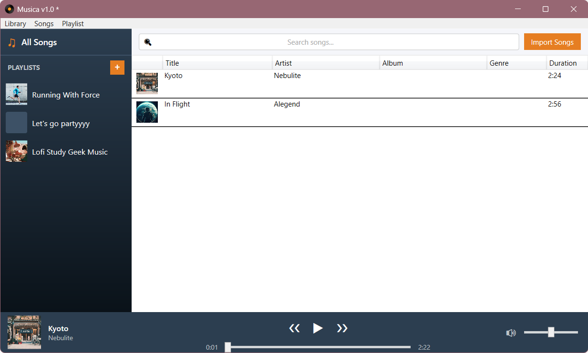
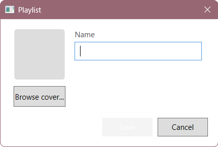
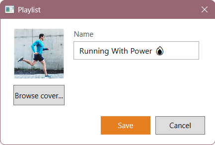

# Musica – Music Library Application

## Application Description

The subject of this assignment is creating an application for managing a personal music library, including browsing song collections and organizing them into playlists.

The application consists of two parts:

1. **Lab:** A base application for managing a music library. In the laboratory part, you will create the main application layout, a window for creating playlists, a sidebar displaying playlists in a ListView with cover icons, and a DataGrid populated with mock song data.
2. **Home:** Completing the laboratory application — extending it with full song import, audio playback, and playlist management. The home part of the application must be implemented following the MVVM pattern (Model – View – ViewModel).

### Laboratory Task

The application should use two distinct colors: a primary color and an accent color. Both colors must be defined in a resource dictionary available to the entire application (including all other windows and views).

---

### Main Window Layout (2p)

The main application window appearance:
- Size width × height: **1000 × 600** (min width 800, min height 480)
- Application title: **Musica**
- Vinyl icon visible on the title bar and taskbar
- Menu with three options — **Library**, **Songs**, and **Playlist**
  - **Library** contains: **New...**, **Open...**, and **Save** (with `Ctrl+S` gesture shown)
  - **Songs** contains: **Import...**, **Edit...**, and **Delete** (with `Del` gesture shown); these do not need to be functional during the lab
  - **Playlist** contains: **New...** (opens the playlist creation window — see next section)
- A left sidebar (width 220 px) on a dark gradient background from primary color to darker primary color, reserved for the playlist list
- A main content area to the right of the sidebar, filling the remaining space
- A bottom bar (height 56 px) reserved for the now-playing controls, visible only when a song is loaded (can be empty for laboratory time, in the primary color)

The two colors must be accessible as named brushes in a `ResourceDictionary` merged into `App.xaml`.

---

### Playlist Creation Window (2p)

The window is opened via the **Playlist → New...** menu item.

The window should:
- Have a fixed size of **360 × 220**, centered over the owner window, non-resizable
- Contain a **name field** (labeled "Name") for typing the playlist title
- Contain a **cover image preview** (80 × 80 px placeholder) that displays the selected image, or a "No Cover" label when none is chosen
- Contain a **Browse cover...** button below the image preview that opens a file dialog for selecting a PNG/JPG image; selected image is shown in the preview and must not be stretched or cropped (use `UniformToFill`)
- Contain **Save** and **Cancel** buttons at the bottom right
  - **Save** is styled with the accent color and is disabled when the name field is empty
  - **Cancel** closes the window without saving

After pressing save, a new playlist should be added to the application to be shown in the main window.

---

### Displaying Playlists in the Sidebar ListView (2p)

The left sidebar contains a `ListBox` showing the available playlists:
- Each list item displays a **cover thumbnail** (36 × 36 px, rounded corners) on the left and the **playlist name** on the right, vertically centered
- If no cover is set, the thumbnail area shows a solid placeholder color
- Items should highlight on hover and show the accent color as background when selected
- The list must not show a horizontal scrollbar
- A "**+**" button in the sidebar header opens the same playlist creation window as the menu item

---

### Song DataGrid with Mock Data (2p)

The main content area contains a `DataGrid` showing a list of songs:
- The DataGrid must be **read-only** and have **full-row selection**
- Columns (in order): **#** (row number or Id), **Title**, **Artist**, **Album**, **Year**, **Duration**
- The Duration column should display values in `m:ss` format (e.g. `3:47`)
- Hard-code at least **5 mock songs** directly in code-behind or as a static list
- The DataGrid should fill the available space and show a vertical scrollbar when content overflows

The DataGrid does not need to be connected to any data source or ViewModel during the lab — a static list assigned in the constructor is sufficient.

---

## Hints

- `ResourceDictionary` and `ResourceDictionary.MergedDictionaries`
- `LinearGradientBrush` for the sidebar background
- `BytesToImageConverter` (or `IValueConverter`) for displaying cover images from `byte[]`
- `ListBox` with a custom `ItemTemplate` and `ItemContainerStyle`
- `ControlTemplate.Triggers` for hover and selection highlight effects
- `DataGrid` with `AutoGenerateColumns="False"` and explicit `DataGridTextColumn` definitions
- `StringFormat` in XAML bindings for number and duration formatting
