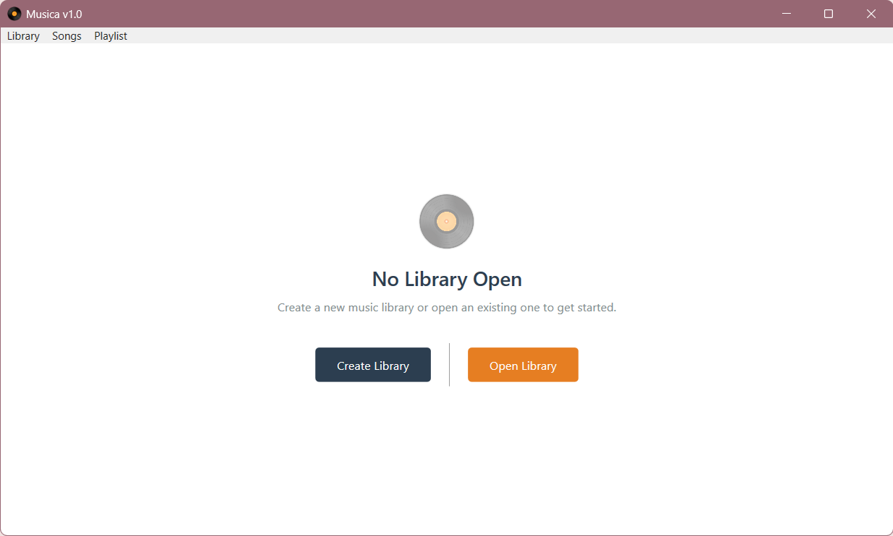
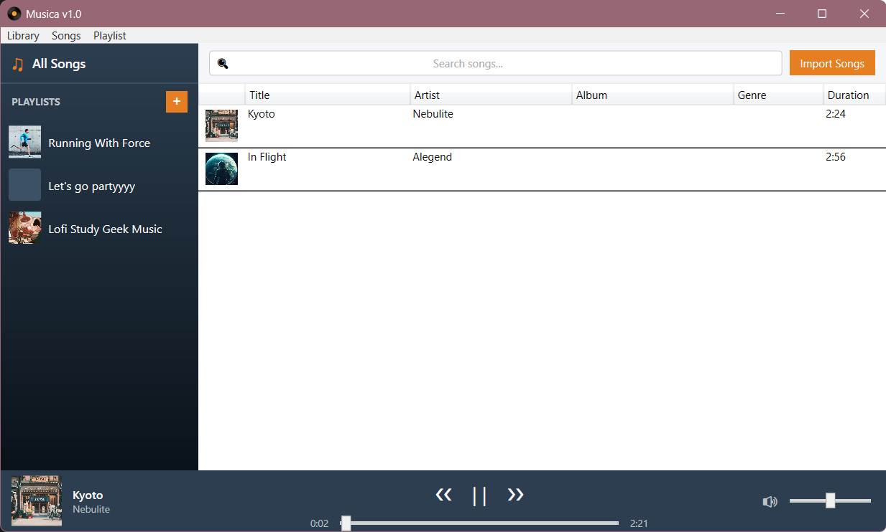
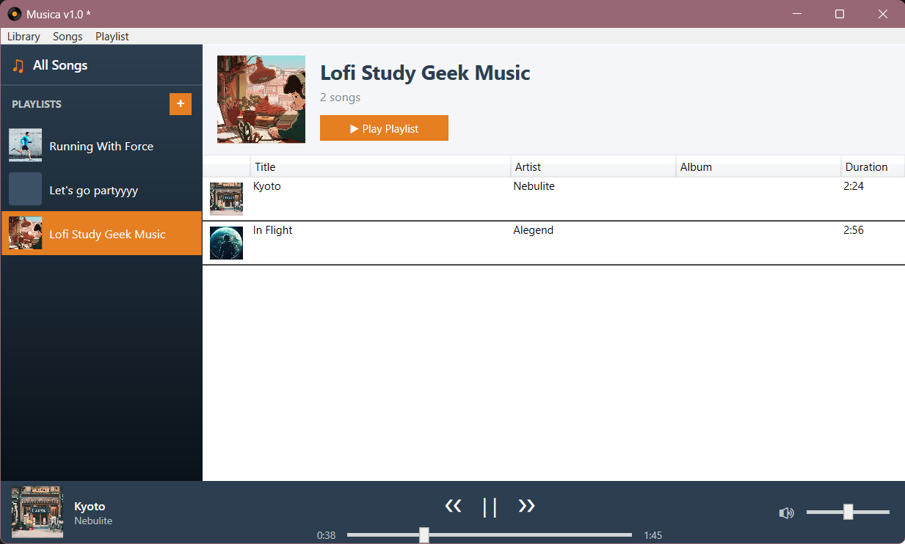
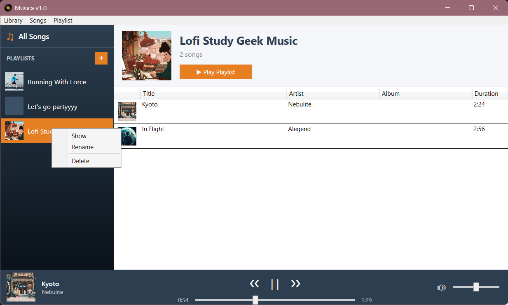
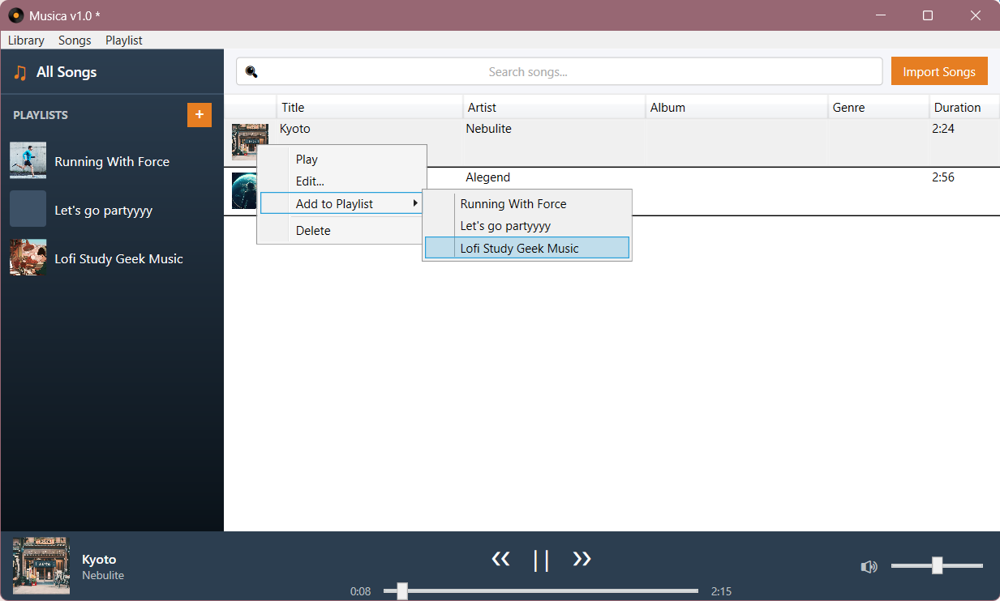
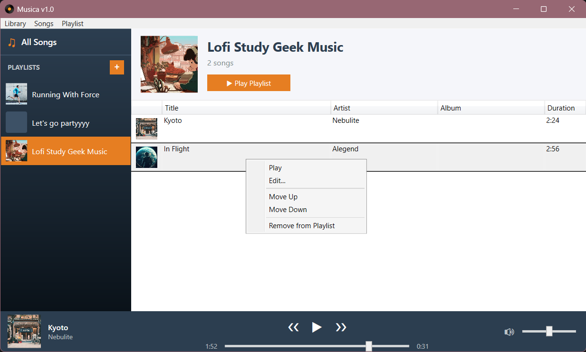
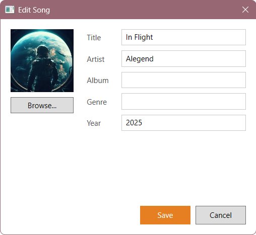

# Musica – Home Assignment (12 points)

## Description

The goal of the home assignment is to complete and extend the application built during the laboratory. The application should be expanded with music library management, song import, audio playback, and full playlist management. The entire home part **must** be implemented following the **MVVM (Model – View – ViewModel)** pattern:

- User interactions handled by **commands** (`ICommand` / `RelayCommand`), not by event handlers in code-behind.
- ViewModels hold state and logic; Views are passive and only react to data bindings.
- `Binding` instead of direct references to controls in code.

---

## Tasks

### 1. MVVM Infrastructure — 1 point

Implement the base infrastructure classes that all ViewModels will use:

#### BaseViewModel
Abstract base class implementing `INotifyPropertyChanged`:
- Method `OnPropertyChanged(string? propertyName)` — raises the `PropertyChanged` event; use the `[CallerMemberName]` attribute so the property name does not need to be passed manually.
- Helper method `SetProperty<T>(ref T field, T value, ...)` — sets the backing field if the value has changed and calls `OnPropertyChanged`; this makes every ViewModel setter a one-liner.

#### RelayCommand
Implementation of `ICommand`:
- Constructor accepting `Action execute` and an optional `Func<bool> canExecute`.
- Second constructor (or overload) accepting `Action<object?> execute` and `Func<object?, bool>? canExecute` — for parameterized commands (e.g. removing a specific song from a playlist).
- The `CanExecuteChanged` event should be wired to `CommandManager.RequerySuggested` so that WPF automatically refreshes button states.
- Method `RaiseCanExecuteChanged()` to manually force a refresh.

---

### 2. Library Management — 1 point

Implement saving and loading the music library to/from a file on disk, and a startup screen.

#### Library File Format
The library is saved to a file in a format of the student's choice. The file stores metadata for all songs (title, artist, album, genre, year, duration, cover art) and playlist definitions. Audio data may be stored inside the same archive or as references to files on disk. The choice of format must be briefly justified when submitting the assignment.

#### Automatic Saving
Saving to the file should happen automatically — every change to the library (adding or removing a song, editing metadata, playlist operations) is immediately reflected in the file, without requiring a manual "Save" click.

#### Library Menu Commands
The **Library** menu contains **New...** and **Open...**:
- **New...** — lets the user choose a location for the new library file and creates an empty library.
- **Open...** — opens a file dialog and loads an existing library.

---

### 3. Views and Navigation — 1 point

Implement the view-switching mechanism in the main window and sidebar navigation.

#### Navigation via MainViewModel
`MainViewModel` manages the currently displayed view in the main content area (to the right of the sidebar). Navigation flow:

**WelcomeView** → (after opening/creating a library) **SongListView** ↔ (after clicking a playlist in the sidebar) **PlaylistView**

**WelcomeView** is displayed on application startup. It contains two buttons bound to the commands from task 2. After choosing an option the application transitions to **SongListView**.

#### WelcomeView + WelcomeViewModel
- `WelcomeView.xaml` — startup screen displayed when the application launches, before the user loads a library. Contains two buttons: **Create New Library** and **Open Existing Library**, bound to commands.
- `WelcomeViewModel` — class with `CreateLibraryCommand` and `OpenLibraryCommand`.

Welcome View:


**SongListView** replaces the previously hard-coded mock data with a live binding to the real song collection from the library. The DataGrid shows columns: cover thumbnail, title, artist, album, genre, and duration.

Song List View:


**PlaylistView** is displayed after clicking a playlist in the sidebar and contains:
- A header with the playlist cover, name, and song count.
- A **Play** button — plays all songs in the playlist from the beginning; disabled when the playlist is empty.
- A DataGrid with the songs belonging to the playlist (same columns as SongListView).

Playlist View:


#### Sidebar
The sidebar (implemented during the lab as a static list) must be connected to the real playlist collection:
- Clicking an item switches the main view to the **PlaylistView** of the selected playlist.
- The "**+**" button in the sidebar header and the **Playlist → New...** menu item both open the playlist creation window.

#### View Switching via DataTemplate
In `MainWindow.xaml` define a `DataTemplate` for each ViewModel type — the `ContentControl` bound to `CurrentPage` will automatically select the correct view without any logic in code-behind:
```xml
<DataTemplate DataType="{x:Type vm:WelcomeViewModel}">
    <views:WelcomeView />
</DataTemplate>
<DataTemplate DataType="{x:Type vm:SongListViewModel}">
    <views:SongListView />
</DataTemplate>
<!-- etc. -->
```

---

### 4. Playlist Management (PlaylistEditViewModel) — 1 point

Rewrite the playlist creation/editing window so that all state and actions are managed by `PlaylistEditViewModel`, with minimal code-behind. Also extend the application with song management within playlists.

#### Opening the Playlist Edit Window
The playlist creation/editing window is opened:
- **When creating** — via the "**+**" button in the sidebar or the **Playlist → New...** menu item; the window opens empty.
- **When editing** — via the **Rename** option in the playlist context menu in the sidebar; the window opens pre-filled with the current name and cover.



#### PlaylistEditViewModel Commands

| Command | Action |
|---|---|
| `BrowseCoverCommand` | Opens a file dialog (PNG/JPG) and loads the selected cover image |
| `SaveCommand` | Confirms the form; disabled when the **Name** field is empty |
| `CancelCommand` | Cancels and closes the window without saving |

The ViewModel closes the window via an event (e.g. `CloseRequested`) that the code-behind subscribes to — the ViewModel does not reference the view directly.

#### Managing Playlist Contents
From **SongListView** (the full song list) it should be possible to add a song to a playlist — for example via a row context menu or a **Songs** menu option. The selected song can be added to any playlist chosen from a list.



From **PlaylistView** it should be possible to:
- Remove the selected song from the playlist (does not delete it from the library).
- Reorder songs within the playlist (Move Up / Move Down buttons or context menu).



Deleting a playlist is available via the **Delete** option in the sidebar context menu.

---

### 5. Song Import — 2 points

Implement the ability to import audio files from disk into the music library.

#### Starting an Import
Import is triggered via **Songs → Import...** from the main menu or a dedicated button in **SongListView**. The file dialog allows selecting one or multiple audio files at once (supported formats: MP3, WAV, WMA, FLAC, AAC).

#### Automatic Metadata Reading
After selecting a file the application automatically reads available metadata from the tags embedded in the audio file:
- Title, artist, album, genre, year.
- Album cover art (if available in the tags).
- Track duration.

If tags are not available, the filename (without extension) is used as the title and remaining fields are left empty.

#### Audio Data
The binary audio data is stored in the `Song` object and persisted in the library, so that playback is possible without needing access to the original file path.

After import the song appears immediately in **SongListView** and is available to be added to playlists.

---

### 6. Song Metadata Editing (SongEditViewModel) — 1 point

Implement a song metadata editing window following the MVVM pattern.

#### Opening the Edit Window
The song edit window is accessible from two places:
- **SongListView** — after selecting a song and choosing **Songs → Edit...** from the menu or via the row context menu.
- **PlaylistView** — via the context menu of the selected row.

#### SongEditViewModel Commands

| Command | Action |
|---|---|
| `BrowseCoverCommand` | Opens a file dialog (PNG/JPG) and loads the selected cover image |
| `SaveCommand` | Confirms the changes; disabled when the **Title** field is empty |
| `CancelCommand` | Cancels and closes the window without saving |

After confirming, changes are saved to the `Song` object and automatically persisted to the library.



---

### 7. Song Search — 1 point

Extend **SongListView** with a search bar that filters the visible song list.

#### Behaviour
- A **Search** text box above the DataGrid filters the list in real time — changing the text immediately updates the displayed collection without requiring a search button click.
- Filtering applies simultaneously to title, artist, album, and genre (case-insensitive).
- When the field is empty, all songs are displayed.
- A **✕** button or clearing the field restores the full list.

---

### 8. Now Playing Bar (NowPlayingBar) — 3 points

Implement a fully functional audio playback bar visible at the bottom of the main window.

#### Starting Playback
Playback is started by:
- Double-clicking a row in **SongListView** or **PlaylistView**.
- Choosing **Play** from the row context menu.
- The **Play** button in the **PlaylistView** header — plays the entire playlist from the first song; the queue consists of the songs in the active playlist.

#### Bar Layout and Contents
The bar (56 px tall, primary color background) is always visible at the bottom of the window and contains:
- **Left:** a cover thumbnail of the currently playing song (56 × 56 px) together with its title and artist; when no song is loaded the bar shows an empty state or a "Nothing playing" label.
- **Center:** **Previous**, **Play/Pause**, and **Next** buttons, a progress slider showing elapsed time and remaining time.
  - **Previous** — enabled only when there is a previous song in the queue.
  - **Next** — enabled only when there is a next song in the queue.
  - Progress slider — allows scrubbing; dragging the slider changes the playback position.
- **Right:** a volume slider.

#### PlayerViewModel
ViewModel managing playback:
- Properties: `CurrentSong`, `IsPlaying`, `Position` (TimeSpan), `Duration` (TimeSpan), `Volume`.
- Commands: `PlayPauseCommand`, `PreviousCommand`, `NextCommand`, `SeekCommand`.
- When the current song finishes, playback automatically advances to the next song in the queue (if one exists).

#### Audio Service
Playback logic should be extracted into a dedicated service class (e.g. `AudioPlayerService`) using `MediaPlayer` or `MediaElement`. The ViewModel communicates with the service, not with a UI control directly.

> **Note:** WPF `MediaPlayer` plays from a file path. Because audio data is stored in memory, it must be written to a temporary file before being loaded into the player.

---

## Scoring

| # | Task | Points |
|---|------|--------|
| 1 | MVVM infrastructure (`BaseViewModel`, `RelayCommand`) | 1 |
| 2 | Library management (`WelcomeView`, file format, automatic saving) | 1 |
| 3 | Views and navigation (`MainViewModel`, `SongListView`, `PlaylistView`, DataTemplate) | 1 |
| 4 | Playlist management (`PlaylistEditViewModel`, adding/removing/reordering songs) | 1 |
| 5 | Song import (file dialog, metadata reading, audio data storage) | 2 |
| 6 | Song metadata editing (`SongEditViewModel`) | 1 |
| 7 | Song search (real-time filtering) | 1 |
| 8 | Now Playing Bar (`NowPlayingBar`, `PlayerViewModel`, audio service) | 3 |
| **Total** | | **12** |

---

## Final Notes

- **No MVVM = no points** for that feature. If a task is implemented via event handlers in code-behind instead of commands, no points are awarded for that section.
- **Compilation** — the project must compile without errors. Non-functional features may result in losing points for tasks that depend on them.
- **File format choice** — when submitting, state which library file format was chosen and why.
